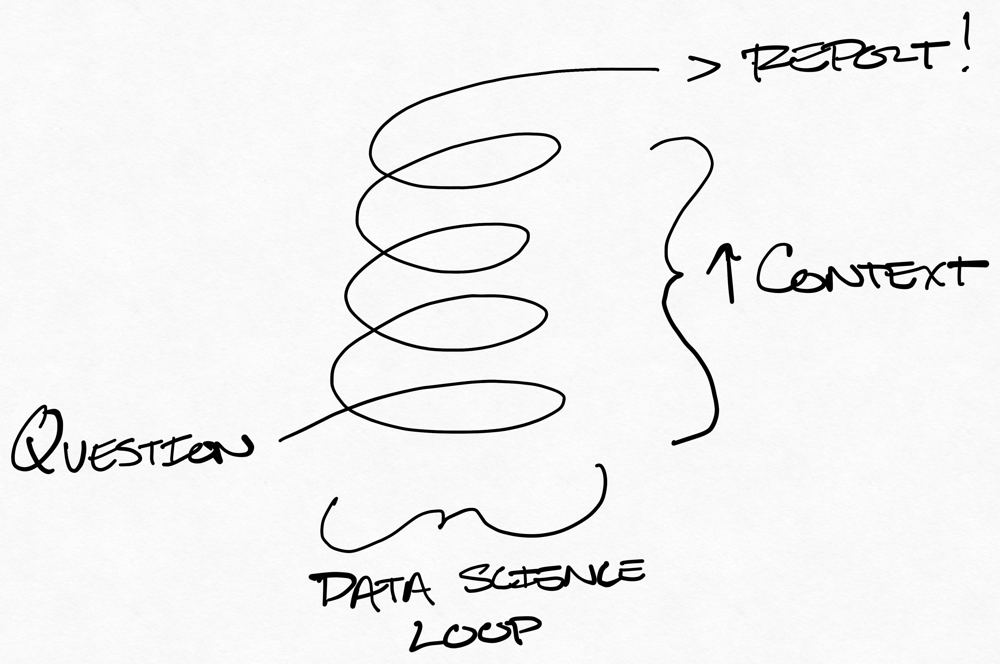
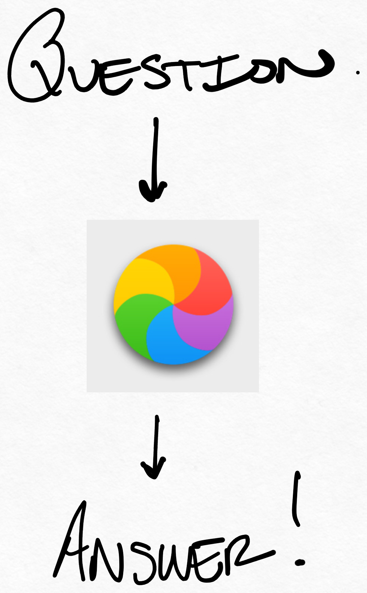
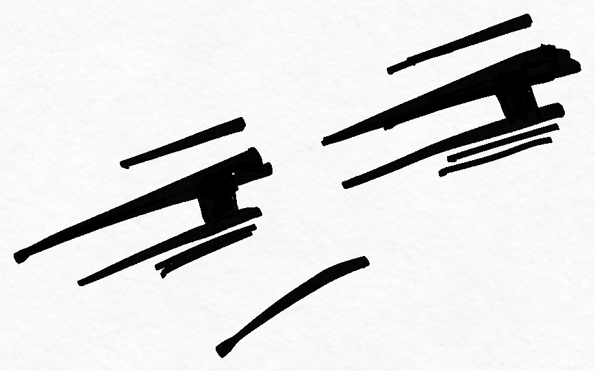

class: center, middle, title-slide

# Getting Credit for Invisible Work

<table><tr>
	<td align="right">
		</img>
	</td>
	<td align=left>
		.name[Ryan Harter]
		Principal Data Scientist, Mozilla
		 <code>blog.harterrt.com</code>
	</td>
</tr></table>

???

As presented at csv,conf on 2021-05-05.

Hey, y'all. I'm Ryan.
I'm a data scientist at Mozilla (you probably know Firefox).
I blog fairly regularly - there's a link to my blog.

I'm here to talk about Invisible Work, and
I'll jump right in since our time is short.

---

# What is "Invisible Work"?

* For this talk, work that:
  * Is critical to success
  * Takes skill to do well
  * Isn't shown to stakeholders

???

To start - what _is_ invisible work?

I'm using a very particular definition for this talk.
It's work that is critical to success,
doesn't get presented to your stakeholder,
and takes skill to do well.

---

# Invisible _Data_ Work 

* Exploratory Data Analysis (EDA)
* Data Cleaning
* User Interviews
* Stakeholder Management

???

Invisible work shows up everywhere,
but it's particularly prominent in Data Science.

This class of work dominates the time to produce good work.
But, most of the time this work doesn't get shared with anyone but the analyst.

---

# The DS Process

</img>

???

My rough view of how data science works:

* We have some question we want to inform with data
* We go explore the data: 
  * generate hypotheses,
  * manipulate data,
  * evaluate guess
* Accruing context the whole time
* Eventually we satisfy ourselves, summarize our work, and deliver

---

# What our stakeholders see:

</img>

???

This is good! Nobody want's complexity.
The DS is providing a valuable service by exploring and summarizing the data.

If I'm doing it right, I'm making my work look simple.

*But*, this can lead to problems when trying to demonstrate our value.

---

# Symptoms

* "Want to see you demonstrate more complexity in your work"
* Need to work on your throughput...
* Apparent pressure to use ML
* Long and boring reports

???

So what does this look like in practice?

It could look like having difficulty when going for promotion.
I personally have gotten this feedback on a performance review 😐 (long ago).

But this type of backwards reasoning happens pretty often.
We conflate complex solutions with complex problems.
Complex work is a cost to be born, not a metric to increase.

Sometimes this encourages ICs to shoe-horn 
machine learning into places it doesn't belong.
More often, this leads to overly-complex and boring-to-read reports
that document every detail of an analysis.
These are both bad for different reasons.

In my experience, this tends to be a problem 
at more junior parts of the job ladder.

While we can try to not to succumb to these pressures, 
**incentives are powerful things**.

---

# So... What do I do?

* Build a narrative for your work
* Arm your manager
* Fight recency bias

???

So... what do I do?

And I guess, idk.
There's no silver bullet for this problem, 
but I can share the strategies that worked well for me.

My hope is that framing this problem well
gets you 90% of the way there.
Having a well-stated problem is a big part of being successful.

(About 6m to this point of the preso if moving fast)

---

# Build a Narrative

* Build a clean, memorable story
* Focus on what was actually **hard** about the work,
  (not just what was technically complex)
* Focus on what **outcomes** you created
* **Don't** share the complexity - nobody wants that

???

I'm going to start by talking about building a narrative,
because this is the keystone of this process.
If we get this piece right, we can bumble around with the other bits.

The goal is to create a clean story about 
what you did and why it was hard.
If you understand this well, you'll be able to convince others.

Three tips for this part:
* Focus on what was **actually hard** about your work.
  Sometimes this is a technical piece. Often it's not.
  Was the hard part scoping the problem and diagnosing the client's real need?
* Focus on what out**comes** you created (broader than out**puts**).
  Sometimes, you avoided doing any work. This is **amazing**.
  Maybe everyone is happy and relieved when they were angry and stressed.
  Awesome! You should get paid for that.
* I want to stress this - sometimes this leads to folks documenting 
  every bit of complexity they faced when working on this problem
  **Don't do this**. No one will take the time to understand it.
  It's just unpleasant to read. 
  You need to summarize why this was hard 
  in a way that can **travel between people**.

If we can do this, we're in good shape.

---

# Arm your manager

* Everyone's busy. They'll be grateful to you for making it easy
* Slip your story to your manager in 1:1s - repetition helps
* Sharing early gives you opportunities to redirect

???

Next step - Arm your manager.

You've built this nice clean story. 
Now you need to get it into the hands of someone who can share it.

You're manager is going to try to get you cash,
but they're going to have to convince others it's a good idea.

The easier you can make this pitch, the better off you'll be.
Your manager will appreciate it too - 
makes thier life easier and makes them look good.

I recommend slipping this story into your 1:1s.
Maybe mention you're practicing a pitch for your work.
Repetition helps polish the story. 
Even better, it makes the story easier to recall later 
(when your manager is stressed in a meeting with their boss's boss).

Another benefit to sharing early and often 
is that it keeps you and you manager on the same page
(and keeps us from building a fantasy about ourselves).
I've been caught in this trap before.
Its important that our narrative passes the smell test.

---

# Fight Recency Bias

* We remember what's recent. The *solution* is the most recent
* We forget:
  * What state we were in at the beginning of this work
  * How difficult it was to choose a direction
  * All the stuff we decided *not* to do

???

Final point - fighting recency bias.

This is a trend I discovered after writing up a few of these narratives.

When I look back at a project, the first thing I remember is the solution.
The problem here is that the solution is 
a solution to **a problem that took a very long time to frame up nicely**.

Most of the time the hard work happens when scoping the problem.
You can even see this in the job ladder.
As you move up the ladder, the problems become less specific and more vague.
Sell how vague your problems are!!!

---

# An example

* `search_aggregates` - ETL for a dataset to summarize search counts
  * Not technically complex (like *at all*)
  * Took 3 months to deliver
  * ???
  * Everyone is thrilled
  * Get promoted

???

So, for the sake of clarity 
I'll share an example of what this might look like in practice.
This is an actual example of some work I did a long while ago.

I built this ETL that created a very simple dataset 
reporting some top-level business metrics.
It was not technically complex *at all*.
What's worse, it took 3 months to deliver.

But - when I did deliver, 
everyone was thrilled and I got promoted not too long after.
What happened here?

---

# What happened?

???

Well - the real difficult part of this project was that
the questions I was getting asked were confused.

I like to give this example - 
It's like someone asked you to buy a refridgerator
because they wanted to keep their house cool.

(queue skeptical face)

--

</img>

???

This would be easy enough to resolve if I just did what was asked,
but I suspected the solution they were asking for wouldn't make them happy.

So I dug in and got a better understanding of the problem.
When I did, I was able to draw clear boundaries around the project
and communicate what problems it would solve and what problems it wouldn't.

The *real* deliverable here was the understanding 
that the executives walked away with.
The actual dataset was a token to demonstrate completion.

---

# Yeah, but what do I _do_

* Snippets
* Brag Doc

???

So there's an example. 

But I realize this isn't the most practical advice yet.
When I was practicing these slides I had a 
"Draw the rest of the owl" moment.

So here are some very tactical things I do 
that have brought a lot of value to my career.

I'll talk about these one-by-one

---

# Snippets

* At the end of every week (or alternating weeks)
* Make a ritual 
* Where you write down what you worked on
* Be specific, include links

???

First - weekly snippets.

This is a habit I picked up at Google.
Since then it's morphed into my own weird process.
I encourage you to build your own process that works for you.

But the core of this habit is making a ritual 
of summarizing what work you did at a regular basis.
I do this every other week, but some prefer weekly.

Try to be specific. Include links to artifacts if you can.
Try to document where you're spending your energy, not just whats obviously work.

This does two things:

* Helps you fight recency bias later
* Helps you spot unnecessary work now

If you only do one of these habits, make it weekly snippets.
It's a super power.

---

# Brag Doc

* Glory fades, scars heal
* It's hard to get excited about old work, capture that here!

???

This is also common advice, but that's because it's useful.

If your unfamiliar, a "brag document" is a doc 
where you keep a list of successes you've had at work or in life.

When I have a win at work, I break out this document
and make a quick note about what I'm excited about.
That might look like: 
"Boss-person liked my report - said it was very easy to read" or
"So and so asked a really good data question today, 
and they wouldn't have been able to do that a year ago".

It sounds conceited, but it's actually really useful.
When I'm looking back at my work, 
it's hard to remember what I was excited about.

When I look back at this brag doc,
it serves as a quasi-index to my weekly snippets
showing me where to look for important work.

Plus, it's a nice dopamine hit.

---

# In Summary

* Invisible work happens
* Get credit by:
  * telling a clean story 
  * about what really happened 
  * to arm your manager
* Probably start keeping [bi-]weekly snippets

---

# Epilogue

If I had more time, I would have made it shorter.

I'll be posting the slides and my speaker notes 
later today or tomorrow on my blog.

https://blog.harterrt.com

Feel free to email me with questions at blog@harterrt.com

---

# Final Note

I'm hiring for a few product-focused DS roles @ Mozilla.

Shoot me a resume at csv@harterrt.com if you're interested!

