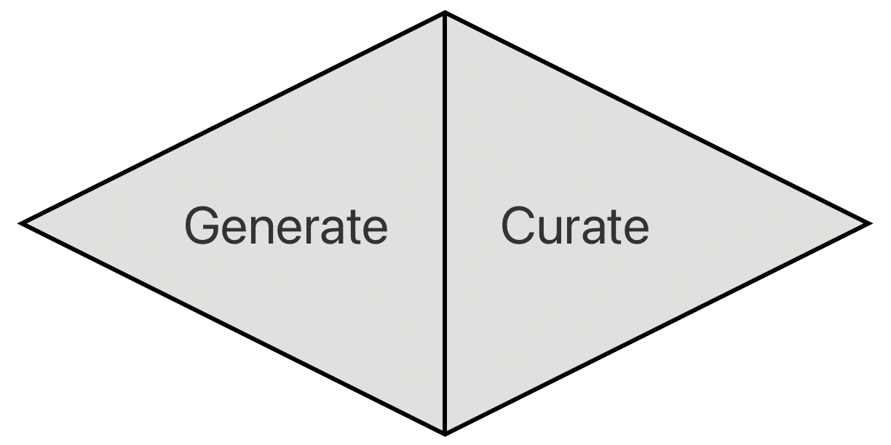
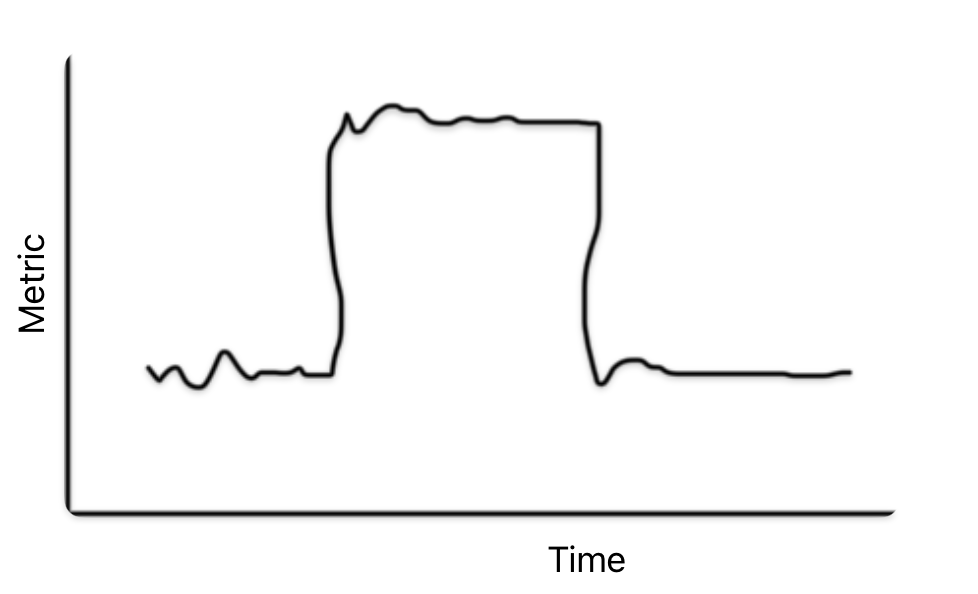
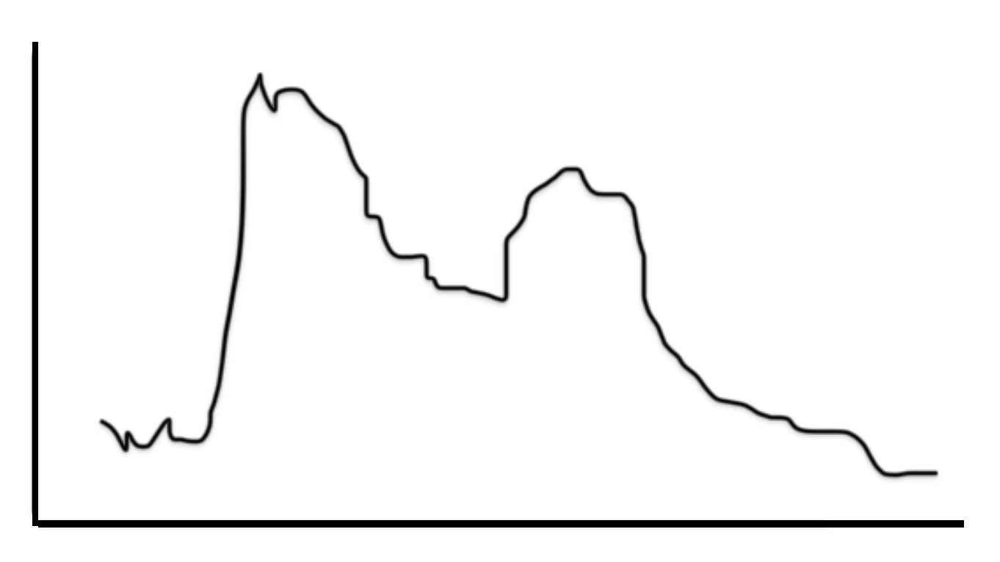
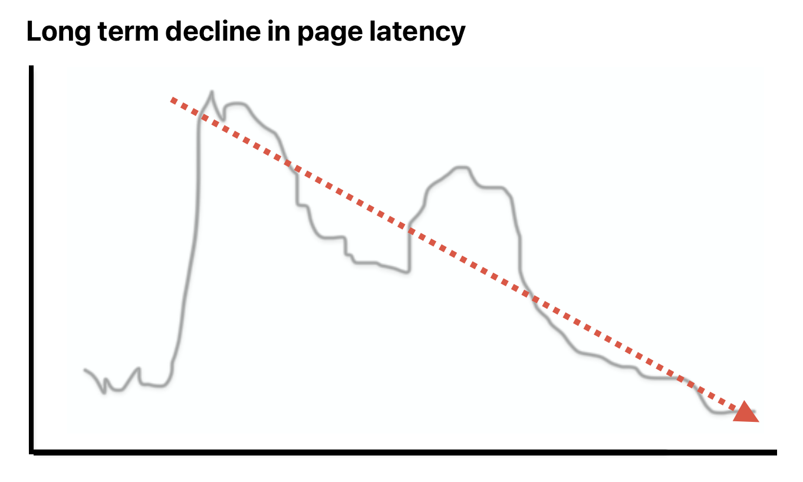

class: center, middle, title-slide

# Practical Strategies   for Data Storytelling

<table><tr>
	<td align="right">
		</img>
	</td>
	<td align=left>
		.name[Ryan Harter]
		Senior Staff Data Scientist, Shopify
		 blog.harterrt.com
	</td>
</tr></table>

???

# Intro

Hey all,

I'm Ryan Harter - I'm a Senior Staff DS at Shopify.

This talk is Practical Strategies for Data Storytelling.

For the last two years
I've run a Data Storytelling workshop at Shopify.

In the process, I've learned some tips and I want to share them here.

# Impact

My goal for this talk is to make you more effective.

* Storytelling - is how effective are you at influencing with your analyses.
* If we can improve our storytelling we can make huge improvements to impact.
* Difference between read/didn't read

---

class: center, middle, title-slide

# Practical Strategies   for Data Storytelling

<table><tr>
	<td align="right">
		</img>
	</td>
	<td align=left>
		.name[Ryan Harter]
		Senior Staff Data Scientist, Shopify
		 blog.harterrt.com
	</td>
</tr></table>

???

# Framing is key

* I'll present some very practical tools.
* But I think the real value of this talk is the **framing**.
* Some measure of storytelling in every job ladder I've seen.
* But very vague
* Once you see what storytelling is and what it means to _do_ good storytelling,
  it becomes very approachable.

# Checkpoint - ~1m

# Here's the problem

---
class: callout

All of your stakehoders are   **busy, tired, and distracted**

???

* The reality of the situation is that 
  all of your stakeholders are **busy, tired, and distracted**.
* Education literature: 
  best case scenario, you'll get **25m from a focused and dedicated reader**.
* You probably don't have that.

* Then the goal becomes - how do we influence this reader?
* Make it natural and easy to understand
* The goal is _not_ to pack as much information into this time as we can

---

# Heuristics

Make your analysis:

* Spread by word of mouth
* While maintaining it's fidelity

.

???

Folks read and understand your analysis.

* Spread by word of mouth
* While maintaining it's fidelity

This is a good heuristic - can folks understand and share your work.

Most common failure case is when an analysis lands with a thud.
Nobody reads it. 
You keep sharing your analysis in conversations and folks just give you a blank look.
Obviously a bummer.

But most folks also have had an analysis that got legs,
shared around the company, then made it into a slide for the board -
but - it was misinterpreted.

Bummer! It could spread by word of mouth, but lost it's meaning.

# Let's get into it

---

# Two stage process

</img>

???

First tip that helps folks - this is a two step process.

Folks struggling with storytelling want to start with the end in mind.
Work directly to a story.

Isn't really possible.

First, you need to generate a ton of context, then we need to curate.

Most folks are familiar with the first half - being in the weeds.
Asking questions, getting answers, iterating.

The second part - curation - usually needs work

When I try to do both, you get writer's block.
I get paralyzed because I don't have the story yet.

So - get comfortable with making a mess, cleaning it up later.

---

class: callout

Don't show your work

???

The most common failure of storytelling is too much detail.

Like I said - you need to do the work, but don't show it!
Nobody cares. And even worse, it's distracting.

This happens for a lot of reasons, but they're all bad.

---

class: callout

This isn't a performance review

???

You and your team have done a lot of great work.
You want to get credit for it and you should.

But this isn't the forum.

And - it distracts from your primary goal of influence.

Your stakeholder should assume you're doing hard stuff.

---

class: callout

The data don't talk

???

A lot of folks want to let the data do the talking.

They present their results with lots of raw data so the reader can make up
their own mind.

This is a mistake.

You already did the work of interpreting the data. 

It takes time and focus and experience to do this well.

Don't make your stakeholder repeat your labor!

It's wasteful.

---
# Offer interpretation

<table>
  <tr>
    <td style="width:33%">
Metric increased by 14.5% on May 11th before decreasing by 15.2% on June 1rd
    </td>
    <td></img></td>
</table>

---
# Offer interpretation

<table>
  <tr>
    <td style="width:33%">
Metric temporarily increased by 15% for three weeks starting May 11th.

  
  

No new information, but easier to read.
    </td>
    <td></img></td>
</table>

---

# Annotate aggressively

</img>

---

# Annotate aggressively

</img>

???

You might be concerned that you're railroading the reader into your interpretation.

You are! The reader needs to be able to trust your interpretation.
That's part of being on the same team.

This is where you add value.

---
class: callout

Get to the point

???

The second biggest storytelling failure is burying the lede.

* This happens everywhere and at every scale.
* The most important sentence is at the end of the paragraph.
* The most important paragraph is on the last page.

Good practice - draft (part 1/2), bold, and reorder.

---

# The academic style

* Introduction
* Methods
* Results
* Conclusion

???

* You're building up this careful argument.
* This is useful, but for a different audience.

You're operating in a high trust environment.
**Your stakeholder has to trust you**.
If they don't, that's a problem to solve.

* If you suffer from this pattern,
* like I do
* Draft in this form. Bold and reverse it.

---
class: callout

Link out to source material

---
class:callout

Make it easy to skim

???

Folks don't read linearly, they bounce around.

Your reader is trying to figure out whether this is relevant to them.

Make it easy to skim.

---

# Use markup and whitespace

We believe that the later-than-usual Easter holiday and the upcoming solar eclipse
are causing this week's new user creation to increase 30% year-over-year.

???

Should be visually appealing.

Avoid long paragraphs.

---

# Use markup and whitespace

New user creation is up 30% year-over-year.

We think this is caused by:

* A later-than-usual Easter
* The upcoming solar eclipse

---
class:callout

The 1/5/15 minute rule

???

---

# Include metadata

* Good title
* TL;DR:
* Who wrote this? When?

---

# How big does the document look?

Ideally we keep it to:

* Three slides and an appendix or
* *One* page

Link out to deeper resources

???

Can happen recursively. Different levels of detail for different audiences.

---
class: callout

Know your audience

???

Also means - have **one** audience.
---
class: callout

New audience → new story

???

Information density.

