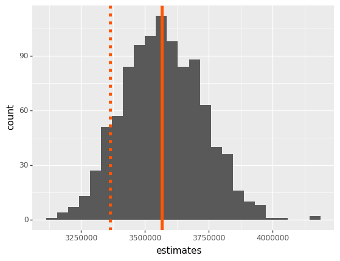
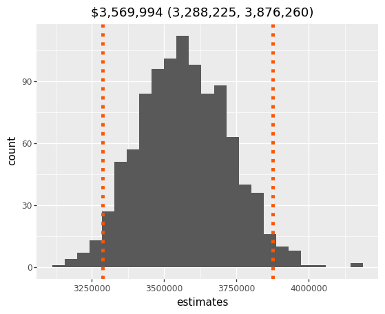
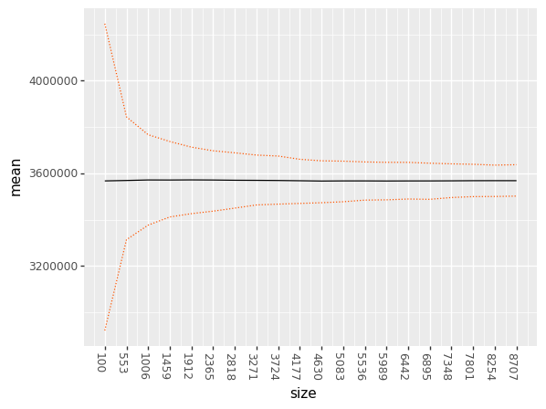
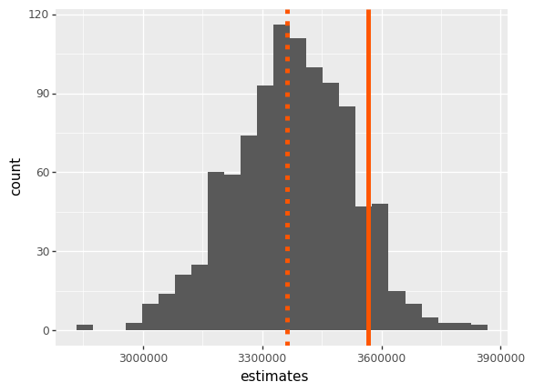
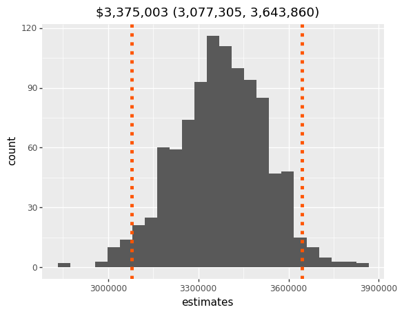

class: center, middle, title

# Common Sense Stats: Bootstrapping

.highlight[**Ryan Harter**] - 
Senior Staff Data Scientist, Mozilla

---

# What are we doing?

* Very brief intro to (some of) statistics
* Avoid magic formulas
* Replace with simulation

---

# Who Am I?

* Senior Staff DS at Mozilla (Firefox)
* Previously with Google
* Fully remote, just south of Rutland
* `harterrt` pretty much everywhere:
  * github.com/harterrt
  * blog.harterrt.com
  * @harterrt
  * harterrt@gmail.com

---

# Who are you?

???

* Statistics? Expert, novice, nothing
* Coding? Expert, novice, nothing

---

# Sampling

* Population: Big and unwieldy
* Sample: Small and wieldy
* Inference: Use the sample to describe the population

---

# Example - Pile of Money


???

For example, let's say you have a Walter White style pile of money.

You don't know the mix of denominations but
you know the pile weighs about 200 pounds.

---

# Example - Pile of Money

## Facts:

* 200 lbs of US Bills (~90k bills)
* Unknown denominations
* Takes 1 hour to count 1 pound
* Takes ~2.5 weeks to count it all

???

A US bill weighs about 1 gram,
there's about 450 grams per pound,
so ~90k bills.

Working 80 hour weeks, it would take 2.5 weeks to count it all.

But, you have better things to do than counting money.
A reasonable person would count a bunch of money and scale it up.

---

# The Plan

* Count one pound of bills
* Multiply by 200
* Good enough for me

???

For this exercise, I've generated some data to represent our pile of money.
I got a random selection of ~90k bills of varying denominations.

---

# The Pile

https://github.com/harterrt/conference-talks/


```python
import pandas as pd

pile = pd.read_csv('data/pile_of_money.csv')
pile_value = sum(pile['denomination'])

print('Number of bills in pile: {0}\n'.format(len(pile)))

print('Sample values:\n {0} \n'.format(pile[10:15].to_string(index=False)))
```

    Number of bills in pile: 90600
    
    Sample values:
      denomination
               20
               50
               20
               20
               10 
    


---

# Sample - Results


```python
bills_per_pound = 450

sample = pile.sample(bills_per_pound, random_state=42)
sample_value = sum(sample['denomination'])

print('Sample value: ${0:,}'.format(sample_value))
print('Estimated population value: ${0:,}'.format(sample_value * 200))
print('Actual population value   : ${0:,}'.format(pile_value))
print(
  '\nError: {0:0.2f}%'
  .format((sample_value * 200 / pile_value - 1) * 100)
)
```

    Sample value: $16,817
    Estimated population value: $3,363,400
    Actual population value   : $3,566,992
    
    Error: -5.71%


---

# Sample - Possibilities?

* What does the risk look like?
* What if we did this 1000 times?
* We have an advantage of seeing everything...

---

# Sample - Simulation

.center[</img>]

---

# Sample Size - The problem

* Great!
* Surprisingly tight for 1 hour of work
* But 1# of bills is arbitrary
* 10 bills is too few, 45k bills is too many
* How much is enough?

---

# Confidence Intervals

* Histograms have too much information, difficult to interpret
* Instead, let's compress the histogram to two numbers

---

# Confidence Intervals - The Plan

* Pick arbitrary confidence level (say 95%)
* Report bounds for most central 95%
* Often looks like:
  * `Point Estimate (lower bound, upper bound)`
  * E.g. `$3.3mm (3.0, 3.6)`

---

# Confidence Intervals - Example

.center[</img>]

---

# Sample Size - The plan

* Build sample distributions for a bunch of different sample sizes
* e.g. 1000 samples of 100 bills -> CI
* Plot the CI's

---

# Sample Size - Simulation

.center[</img>]

---

# Summary

* Cool, right?
* But not useful in practice
* We never see the population...

---

# Bootstrapping (... Finally)

* What if we re-use our sample?
* Contains all we know about the population
* Construct fake samples from our existing sample (**pseudo-sample**)

???

* The problem here is that our function requires the `population`
* All we see is the **sample**
* So let's devise a solution that only uses the sample

---

# Real quick: Sampling with Replacement

* If our sample is 450 bills, randomly choose a bill 450 times
  * Without replacement, pseudo sample == sample
  * With replacement, pseudo sample is only *similar to* sample
* Like drawing 52 cards from a deck
  * With replacement, interesting (7 Aces, 0 Jacks, etc)
  * Without replacement... a deck of cards?

---

# Bootstrapping

* TODO: Add sample and population values to chart
* TODO: Add confidence intervals to chart

.center[</img>]

---

# Reminder - Sampling distribution

.center[</img>]

---

# Bootstrapping

* Neat!
* Biased to the left (just like our sample)
* But similar breadth, good for "How close am I?"

---

# Bootstrapping - Confidence Intervals

.center[</img>]

---

# Confidence Intervals - Reminder

.center[</img>]

---

# At Mozilla

* Experiments!
* A/B test changes to Firefox
* Can't measure the population, because we want a control!
*
---

# At Mozilla

* Treatment branch: 34.2 pages per day
* Control branch: 33.7 pages per day
* ~1.5% increase

TODO: Add code snippet to demonstrate elegance

---

# Alternatives

* Just for reference
* Central Limit Theorem and Normal Hypothesis
